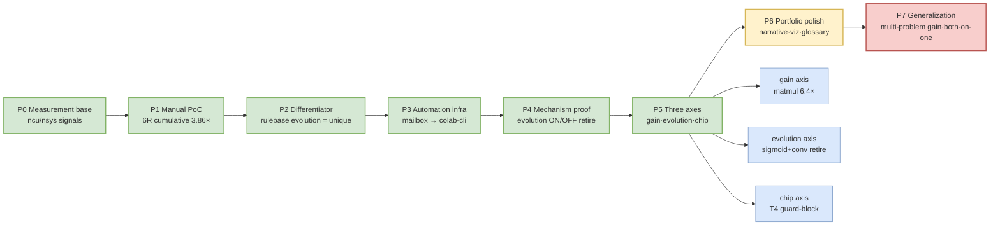
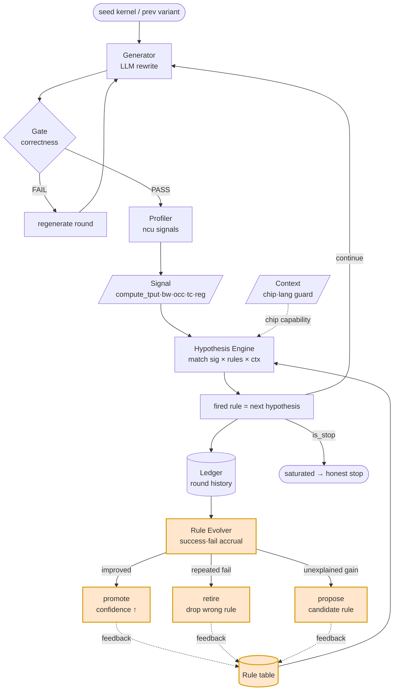
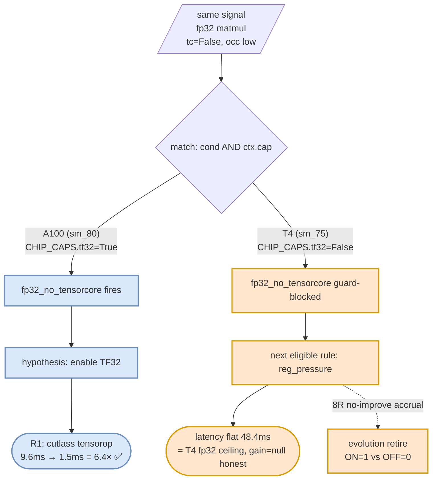

# GPU-Solver

An agentic GPU kernel-optimization loop where an **LLM agent evolves its own classification
rules from profiling measurements**. The evolution mechanism is proven with a controlled
ON/OFF ablation on real A100 hardware. Performance gain is demonstrated on a compute-bound
matmul (6.4×, A100); multi-problem generalization is stated honestly as future work.

> This README is the methodology narrative. For internals see [`loop/README.md`](loop/README.md).

## One line

Prior art (CUDAMaster, arXiv 2603.07169) already implements the "deterministic rule label →
LLM rewrite → measure-verify" pipeline. **My contribution = the classification rule table itself
evolves from measurement feedback.** All 6 surveyed prior systems use static rules.

## Roadmap

Eight phases from measurement base to generalization. **P0–P5 done** (green), **P6 in progress**
(yellow), **P7 future** (red). The three axes (gain · evolution · chip) branch at P5 — each proven
separately.



> 🟢 done · 🟡 in progress · 🔴 future. Currently at P6 (portfolio polish).

## Architecture

One round = generate → gate → profile → match (hypothesis) → ledger → evolve. **The differentiator
is the feedback from `evolve` back into the rule table** (retire / promote / propose) — the rule table
itself evolves from measurement. Surveyed prior systems lack this feedback edge (static rules).



> 🟠 Orange = the differentiator (rule-evolution feedback). Prior art has no edge into `rules`.

### Environment as a first-class rule input (chip guard)

The same fp32 matmul signal fires a **different rule depending on chip capability** (`CHIP_CAPS`).
A100 has TF32 → `fp32_no_tensorcore` fires (6.4× via tensor cores). T4 has no TF32 (sm_75) → the
guard blocks it → the next eligible rule `reg_pressure` fires. Two-layer defense: the chip guard
blocks *known* bad hypotheses up front; rule-evolution retires *unknown* bad ones from measurement.



## What I proved (claimable)

### 1. Measurement-feedback rule-evolution meta-loop — mechanism proven

**Evidence (real A100, sigmoid, 14 rounds, `loop/run_gain_compare.py`):**
- Evolution **ON** = a wrong `fp32_no_tensorcore` rule fired 4 times, failed, was retired →
  auto-switched to `memory_bound_fusable`.
- Evolution **OFF** = the same fp32 rule misfired 6 times forever (fake signal).
- = "a wrong static rule gets retired by measurement and replaced by the right one" — closed on real GPU.

### 2. Self-validation via ablation (the core contribution)

The ON/OFF above is not a demo. It is an **ablation that isolates which component (evolution)
produces the effect.** The same variant queue was fed fairly to both tracks, so the difference
is controlled to the single variable of evolution presence/absence.

### 3. The loop reaches a faster kernel by measurement — gain layer first breakthrough

| Problem | Attempt | Result |
|---|---|---|
| **matmul (4096² fp32)** | loop R0(fp32)→`fp32_no_tensorcore` fires→R1(TF32) | ✅ **9.6ms→1.5ms = 6.4× gain** |
| sigmoid | `--latency` 12R, BLOCK variants | null — memory-bound ceiling (no headroom) |
| groupnorm | split-parallel (3 algorithms) | null — DRAM BW ceiling |
| llama | TF32 OFF vs ON | null — attention (flash) 54% dominates, matmul 23% not bottleneck |

**matmul: the loop autonomously reached a 6.4×-faster kernel via measure→hypothesis→rewrite.** First
demonstration of "measure → hypothesis → rewrite → faster kernel." sigmoid/groupnorm nulls are real
ceilings (memory-bound); llama is attention-dominated — not a loop defect, a problem property.

<p align="center"></p>

> ⚠️ **Measurement integrity:** matmul first read 95ms parity ("environment limit"), but the cause
> was a bug — `_profile_ncu` measured only 1 kernel (`--launch-count 1`). Summing all-kernel durations
> revealed the 6.4×, cross-checked by ncu kernel names (sgemm vs tensorop) and theoretical FLOP.

## What I did NOT prove

- ❌ **Evolution superiority ON>OFF.** On matmul the first fired rule is correct → no retire → ON≈OFF.
  Evolution's benefit is shown separately by sigmoid's misfire-retire. The gain axis and evolution axis
  are not demonstrated together on one problem.
- ⚠️ **Multi-problem generalization — evolution axis ✅ 2 problems, gain axis still 1.** evolution =
  sigmoid + conv2d (conv: `fp32_no_tensorcore` misfire → ON=2 retires→uncoalesced, OFF=forever, A100 8R);
  gain = matmul (conv gain=null, compute ceiling). Multi-problem *gain* is unproven.
- ⚠️ **Two axes, separated:** loop improves (gain ✅ matmul) + evolution beats static (✅ sigmoid+conv,
  and retire re-observed on T4 = ON 1 vs OFF 0) = evolution is multi-problem, gain is single. Both-on-one
  = future work, confirmed structurally hard twice (matmul_tri: first rule always correct; conv: retire
  happens but the following rule's gain=null). (T4 retire shows the *mechanism* across a 2nd chip.)

<p align="center"></p>

> The difference is the **retire**, not the latency — both tracks stay flat at the T4 fp32 ceiling.
> This "a rule gets dropped by measurement" step is exactly what static-rule prior art cannot do.
  - **Both-on-one confirmed structurally hard (by measurement).** A deliberately uncoalesced Triton matmul
    was tried to get "wrong rule → retire → right rule → gain," but the seed rules fit so well the first
    fired rule is always correct → no retire. Wrong-rule-fires-naturally = memory-bound (gain ceiling) vs
    right-rule = compute (no retire) = mutually exclusive. The limit itself was established by measurement.

## Repository layout

```
loop/                  # the optimization loop (separate concerns, self-checkable)
  signals.py           # profiling-signal extraction (bw_pct, tensorcore_active, ...)
  rules.py             # classification rule table (seed rules)
  evolver.py           # rule evolution: confidence ±1, retire, candidate proposal
  ledger.py            # round/decision history
  generator.py         # LLM kernel rewrite (callback for PoC; real generator behind API key)
  harness.py           # optimization round driver
  executor.py          # kernel run / measurement
  mailbox.py           # local side of git-mailbox async cmd/result channel
  watch.py             # Colab side of git-mailbox (polling, idempotent, fault-isolated)
  run_gain_compare.py  # evolution ON/OFF ablation (the mechanism proof)
  run_gain_hypcond.py  # hypothesis-conditional callback driver
  run_multiproblem.py  # multi-problem rule-firing observation
  selfcheck.py         # GPU-free local self-check
problems/{llama,sigmoid,groupnorm}/solve.py
colab_mailbox.ipynb    # Colab watch notebook (auth via Colab Secrets)
```

## Run

```bash
# GPU-free local self-check (logic only — no torch/ncu)
python3 loop/selfcheck.py

# evolution ON/OFF ablation (needs a live Colab A100 watch via git-mailbox)
python3 loop/run_gain_compare.py <problem>
```

The git-mailbox pattern (this repo ↔ a separate `gpu-mailbox` repo) carries async cmd/result
JSON between a local runner and a Colab `watch` process — no SSH tunnel, deployable with a single
repo-scope PAT.

**Full setup (mailbox repo, Colab watch, PAT via Secrets): [`docs/SETUP.md`](docs/SETUP.md).**

## Reproducibility

The gain-measurement infrastructure is ready — retry as-is once the environment is PoC-grade (1.4ms):
- `loop/run_gain_hypcond.py` = hypothesis-conditional callback driver (selects code by fired rule label).

## License

Personal portfolio / research prototype.
