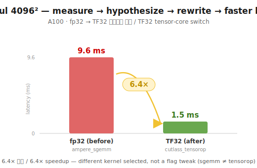
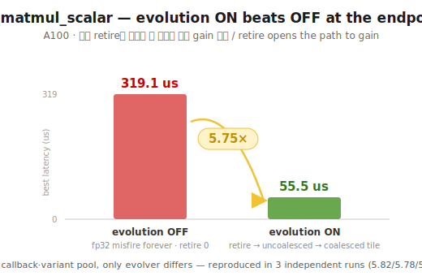
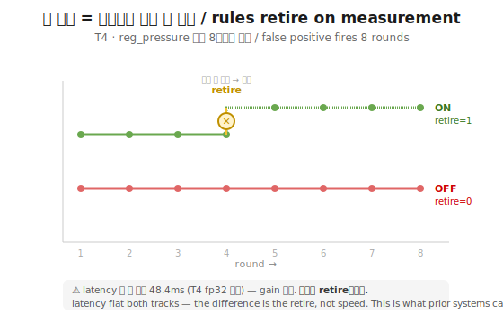
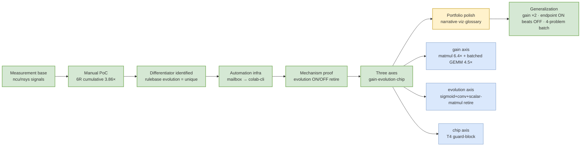

# GPU-Solver

 

> This README is the methodology narrative. For internals see [`loop/README.md`](loop/README.md).

## 1. What this is

An agentic GPU kernel-optimization loop where the **classification rule table itself evolves
from profiling measurements**. On real A100 hardware: the evolution mechanism is proven by
controlled ON/OFF ablation, performance gain is shown on two compute-bound problems
(matmul **6.4×**, batched GEMM **4.5×**), and — the endpoint claim — **evolution ON reaches a
5.75×-faster kernel than OFF on the same problem** (misfire retire → correct rule → gain,
reproduced by re-running the same procedure 3 times). A natural 4-problem KernelBench batch shows
the loop judging each workload correctly (bandwidth-ceiling problems: honest immediate stop;
headroom problem: retire→gain) with **zero cases where evolution made things worse**.

## 2. Why this is needed

Prior art (CUDAMaster, arXiv 2603.07169) already implements the "deterministic rule label →
LLM rewrite → measure-verify" pipeline — that part is not new. All 6 surveyed prior systems
(including CUDAMaster and AutoKernel) use a **static** rule table: the LLM decides which
hypothesis to try, and the rule set that drives that decision never changes.

**My contribution is narrow and specific: the classification rule table itself evolves from
measurement feedback.** A rule that keeps failing gets retired from measurement, not from an
LLM's judgment call — bottleneck classification stays rule-based, deterministic, auditable, and
reproducible; the LLM is used only for code rewriting, never for judging whether a hypothesis
is right. This is a meta-loop no surveyed system implements, and it is the entire scope of the
claim — no broader novelty is asserted.

This project is one of three sibling projects that share the same optimization-loop discipline
applied to different objective functions: [compiler-thermal](https://github.com/alexxony/compiler-thermal)
forks this engine unchanged and swaps the objective for RC-model ΔT (thermal-aware compilation),
and [hbm-build](https://github.com/alexxony/hbm-build) provides the Ansys Icepak thermal
ground-truth this stack calibrates against. All three independently follow the same discipline —
ON/OFF ablation, immediate ledger recording, honest negative-result reporting — documented per
repo (this repo: `JOURNAL.md` + sections 4-5 below).

## 3. How it works



One round = generate → gate → profile → match (hypothesis) → ledger → evolve. **The differentiator
is the feedback from `evolve` back into the rule table** (retire / promote / propose) — the rule
table itself evolves from measurement. Surveyed prior systems lack this feedback edge (static
rules); above, the orange edges into `rules` are exactly what static-rule prior art cannot do.

### Environment as a first-class rule input (chip guard)

The same fp32 matmul signal fires a **different rule depending on chip capability** (`CHIP_CAPS`).
A100 has TF32 → `fp32_no_tensorcore` fires (6.4× via tensor cores). T4 has no TF32 (sm_75) → the
guard blocks it → the next eligible rule `reg_pressure` fires. Two-layer defense: the chip guard
blocks *known* bad hypotheses up front; rule-evolution retires *unknown* bad ones from measurement.


### Repository layout

```
loop/                  # the optimization loop (separate concerns, self-checkable)
  signals.py           # profiling-signal extraction (bw_pct, tensorcore_active, ...)
  rules.py             # classification rule table (seed rules)
  evolver.py           # rule evolution: confidence ±1, retire, candidate proposal
  ledger.py            # round/decision history
  generator.py         # LLM kernel rewrite (callback for PoC; real generator behind API key)
  harness.py           # optimization round driver
  executor.py          # kernel run / measurement
  colab_profiler.py    # colab-cli transport (single blocking `colab exec`, retry-hardened)
  run_gain_compare.py  # evolution ON/OFF ablation (the mechanism proof)
  run_gain_hypcond.py  # hypothesis-conditional callback driver (the endpoint proof)
  run_ablation_remote.py # whole-batch remote ablation: N problems × ON/OFF in ONE colab exec,
                       #   self-healing session (auto re-provision on Colab reclaim)
  run_multiproblem.py  # multi-problem rule-firing observation
  selfcheck.py         # GPU-free local self-check
  mailbox.py, watch.py # legacy git-mailbox transport (replaced by colab-cli; kept for history)
problems/{llama,sigmoid,groupnorm,matmul,matmul_tri,2d_convolution,batched_gemm,
          kb_softmax,kb_layernorm,kb_reduce,kb_matmul_scalar}/solve.py
colab_mailbox.ipynb    # legacy Colab watch notebook
```

### Run

```bash
# GPU-free local self-check (logic only — no torch/ncu)
python3 loop/selfcheck.py

# whole-batch ablation: N problems × evolution ON/OFF in ONE colab exec (recommended)
# needs google-colab-cli authenticated (`uv tool install google-colab-cli`, one OAuth)
python3 loop/run_ablation_remote.py kb_softmax,kb_layernorm,kb_reduce,kb_matmul_scalar 12 \
    --session=abl --gpu=A100     # --gpu enables self-healing session re-provision

# per-round variant: evolution ON/OFF via colab-cli round-trips
python3 loop/run_gain_compare.py <problem> --colab-cli --session=<s>
```

Transport is **google-colab-cli** (official CLI): the rule engine is deterministic (zero LLM in
judgment), so the entire ablation loop runs server-side in one `colab exec` — the local machine
only ships code and collects a JSON ledger. The older git-mailbox transport is retained for history.

Methodology details: [docs/METHOD.md](docs/METHOD.md)

## 4. Evidence — where to look

### 1. Measurement-feedback rule-evolution meta-loop — mechanism proven

**Evidence (real A100, sigmoid, 14 rounds, `loop/run_gain_compare.py`):**
- Evolution **ON** = a wrong `fp32_no_tensorcore` rule fired 4 times, failed, was retired →
  auto-switched to `memory_bound_fusable`.
- Evolution **OFF** = the same fp32 rule misfired 6 times forever (fake signal).
- = "a wrong static rule gets retired by measurement and replaced by the right one" — closed on real GPU.

### 2. Self-validation via ablation (the core contribution)

The ON/OFF above is not a demo. It is an **ablation that isolates which component (evolution)
produces the effect.** The same variant queue was fed fairly to both tracks, so the difference
is controlled to the single variable of evolution presence/absence.

### 3. The loop reaches a faster kernel by measurement — gain layer first breakthrough

| Problem | Attempt | Result |
|---|---|---|
| **matmul (4096² fp32)** | loop R0(fp32)→`fp32_no_tensorcore` fires→R1(TF32) | ✅ **9.6ms→1.5ms = 6.4× gain** |
| **batched GEMM (torch.bmm, B=16·N=1024)** | same contract, `fp32_no_tensorcore`→TF32 | ✅ **2631us→580us = 4.5× gain** |
| sigmoid | `--latency` 12R, BLOCK variants | null — memory-bound ceiling (no headroom) |
| groupnorm | split-parallel (3 algorithms) | null — DRAM BW ceiling |
| llama | TF32 OFF vs ON | null — attention (flash) 54% dominates, matmul 23% not bottleneck |

**matmul: the loop autonomously reached a 6.4×-faster kernel via measure→hypothesis→rewrite.** First
demonstration of "measure → hypothesis → rewrite → faster kernel." sigmoid/groupnorm nulls are real
ceilings (memory-bound); llama is attention-dominated — not a loop defect, a problem property.

<p align="center"></p>

> ⚠️ **Measurement integrity:** matmul first read 95ms parity ("environment limit"), but the cause
> was a bug — `_profile_ncu` measured only 1 kernel (`--launch-count 1`). Summing all-kernel durations
> revealed the 6.4×, cross-checked by ncu kernel names (sgemm vs tensorop) and theoretical FLOP.

### 4. Evolution ON beats OFF at the endpoint — the headline claim

**Evidence (real A100, kb_matmul_scalar, `loop/run_gain_hypcond.py` / `run_ablation_remote.py`,
same procedure re-run 3 times: 5.82× / 5.78× / 5.75×):**
- **OFF**: the misfiring `fp32_no_tensorcore` rule fires forever, its faithful prescription (TF32)
  is physically inert on a hand-written scalar Triton kernel → best stays at **~319us**.
- **ON**: the same misfire accumulates failures → **retire** → the next eligible rule `uncoalesced`
  fires (load_eff 41.7% *measured*, not a default-value artifact) → its faithful prescription
  (K-tiled coalesced loads, `tl.dot(..., input_precision="ieee")` = FFMA, tensor cores excluded)
  lands at **~55us**, then `tensorcore_saturated` stops the loop.
- **= 5.75× purely from evolution being ON.** Both tracks share the same callback and the same
  variant pool; the only difference is the evolver. This is the causal chain
  *misfire-retire → correct rule → faster kernel* closed on one problem.

<p align="center"></p>

> Honest scope: retire (rule A's event) and gain (rule B's event) are *sequential*, not one event —
> the claim is the endpoint of the causal chain, not simultaneity. The ON-stop trigger leans on a
> residual 0.02% HMMA tripping the tc boolean; the gain itself is FFMA (probe-verified).

### 5. Natural multi-problem batch — the loop judges each workload correctly

**Evidence (real A100, 4 KernelBench-derived problems, one `colab exec`, `loop/run_ablation_remote.py`):**

| Problem | Fired rule | ON vs OFF |
|---|---|---|
| kb_softmax | `memory_saturated` → STOP | identical (BW ceiling — correct stop, 0 wasted rounds) |
| kb_layernorm | `memory_saturated` → STOP | identical |
| kb_reduce | `memory_saturated` → STOP | identical |
| kb_matmul_scalar | misfire → retire → `uncoalesced` | **ON 55.5us < OFF 319.1us = 5.75×** |

No staged queues — natural signals only. **Zero cases where evolution made things worse.**
The loop runs everywhere; gain is decided by the workload, not the loop.

<p align="center"></p>

> T4 evidence above: the difference is the **retire**, not the latency — both tracks stay flat at the
> T4 fp32 ceiling. The same retire mechanism later opens the gain path on A100 (section above). This
> "a rule gets dropped by measurement" step is exactly what static-rule prior art cannot do.

### Reproduce

Every headline number in this README is reproducible with one command on a Colab A100. All
claims trace to ledger rows (JSON, written both locally and remotely):

```bash
# Endpoint 5.75× + 4-problem batch (re-run 3× to reproduce 5.82×/5.78×/5.75×)
python3 loop/run_ablation_remote.py kb_softmax,kb_layernorm,kb_reduce,kb_matmul_scalar 12 \
    --session=abl --gpu=A100

# Gain axis (matmul / batched GEMM)
python3 loop/run_gain_compare.py matmul --latency --colab-cli --session=<s>
python3 loop/run_gain_compare.py batched_gemm --latency --colab-cli --session=<s>
```

## 5. Limits / not proven

- **Sample size is small.** The natural multi-problem batch is 4 problems (1 headroom + 3
  bandwidth-ceiling). The batch driver (`run_ablation_remote.py`, one `colab exec` per batch)
  already scales to the KernelBench 250-problem set — that infrastructure is in place and tested;
  running the full 250-problem batch is seed-wrapping work, not new mechanism, and has not been done.
- **"Both axes as one event" is not claimed.** Retire (rule A's event) and gain (rule B's event) are
  sequential by construction — the harness attributes each round's outcome to the single fired rule.
  What is proven is the *endpoint of the causal chain* (ON reaches a faster kernel than OFF);
  single-event simultaneity was twice confirmed structurally out of reach and is deliberately not
  engineered around.
- **No SOTA performance claim.** The differentiator is interpretable, auditable, evolving judgment
  (zero-LLM bottleneck classification) — orthogonal to absolute kernel performance.
- **"Reproduced 3 independent runs" means the same procedure re-run 3 times**, not verification by
  an isolated second party working from raw artifacts alone. There is no separate-verifier /
  pre-registration workflow documented in this repository (its siblings `compiler-thermal` and
  `hbm-build` do document one); the 5.75×/5.78×/5.82× spread is procedure-repeatability evidence,
  not independent-reviewer evidence.
- **Rule-firing correctness has not been adversarially tested** — the rule table has been exercised
  on the problems above, not stress-tested against adversarial or out-of-distribution kernels.

## 6. Status

Eight phases from measurement base to generalization. **P0–P5 and P7 done**, **P6 (portfolio
polish) in progress**. The three axes (gain · evolution · chip) branch after the mechanism proof
and are joined by the endpoint ablation (evolution ON beats OFF on one problem).



> 🟢 done · 🟡 in progress. Currently in portfolio-polish; the generalization phase's endpoint
> claim (section 4.4) landed first. Next: expand the natural batch beyond 4 problems toward the
> KernelBench 250-problem set (infrastructure ready, not yet run).

## License

MIT. See [`LICENSE`](LICENSE).
